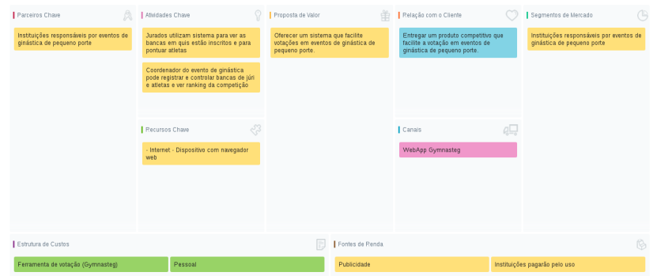

|    Data    | Versão |               Descrição               |                   Autor(es)                    |
| :--------: | :----: | :-----------------------------------: | :--------------------------------------------: |
| 29/09/2019  |  0.1   |         Criação do documento          | Igor Veludo, Byron Kamal |

Este documento tem o objetivo de apresentar a construção do documento canvas do projeto. Abaixo, encontra-se o canvas correspondente que possui como objetivo estruturar o modelo de negócio do projeto.

## Canvas Gymnasteg

