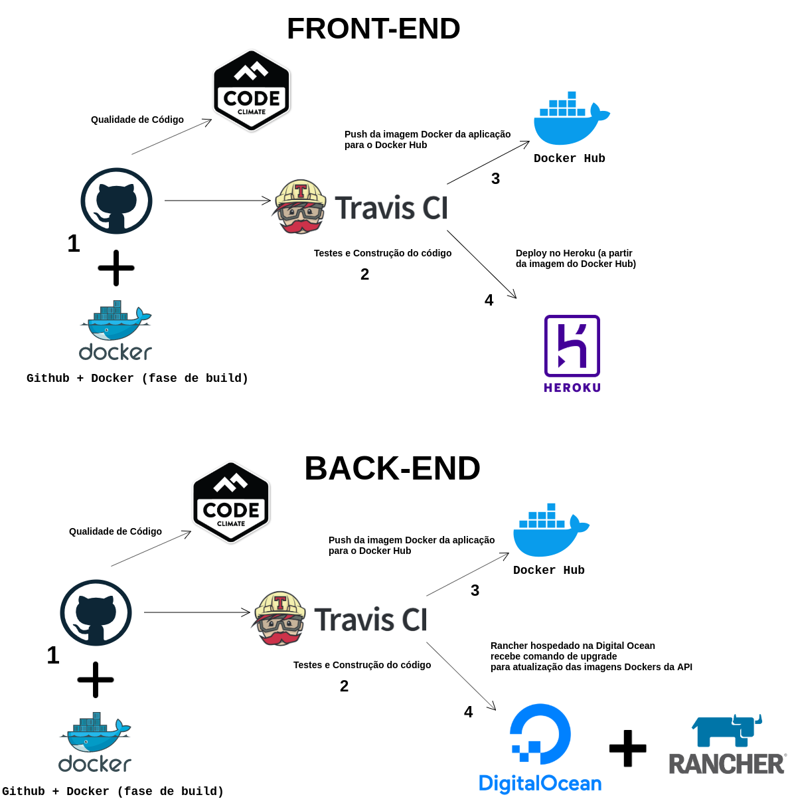

## Introdução 
Este documento tem como objetivo resumir as etapas de DevOps utilizdas no projeto, desde a ferramenta de versionamento até a o deploy contínuo.

## Etapas

### Build
#### Controle de Versão
Para o controle de versão do código é utilizado o Gitub e é onde define-se o conteudo utilizado nos ambientes de Homologação e Produção.

#### Docker
Docker é uma ferramenta que permite empacotar (container) a aplicação em de forma padronizada, para assim funcionar em qualquer lugar. Um Container é a forma de empacotar sua aplicação e suas dependências (bibliotecas) de forma padronizada. 

#### Qualidade de Código
A qualidade e saúde do código é analisada através da ferramenta Code Climate, que analisa aspectos como complexidade, tamanho de métodos, trechos duplicados e "mau cheiro" (code smells) no código.

### Continuos Integration
#### Build e Testes
A ferramenta utilizada para a execução dessa etapa é o Travis CI. Nessa parte o código é testado e construído para integrar as alterações realizadas pela equipe. 
Após o build uma imagem Docker é enviada para o Docker Hub. Depois, é aberto um PR para a branch pertinente de acordo com o ambiente (Homologação ou Produção) em que pretende-se fazer o deploy e, logo após. é feito a analise manual do PR.

### Deploy
#### Heroku
Após construida a imagem e essa ser enviada para o Docker Hub, alguns comandos são executados no Travis CI e a imagem docker, já dísponivel no Docker Hub, é enviada para o Heroku, onde é feito o deploy e a aplicação pode ser acessada.

### Pipilene de Devops

