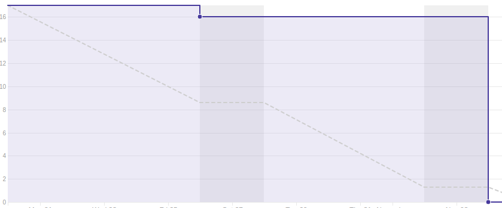
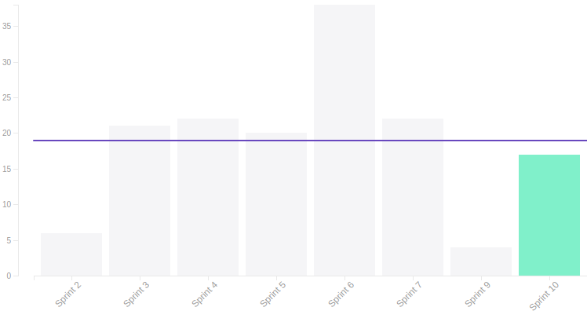
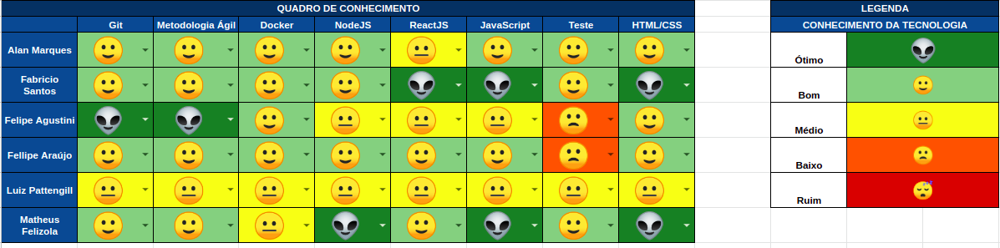

## 1. Sprint 10

**Data de início:** 21 de outubro.

**Data de término:** 28 de outubro.

### Reunião
#### Data da reunião: 27/10

|Nome|Presente|
|----|----|
|Byron Kamal|:heavy_check_mark:|
|João Victor|
<strong>JUSTIFICADO</strong>
|
|Matheus Felizola|:heavy_check_mark:|
|Igor Veludo|:heavy_check_mark:|
|Alan Marques|:heavy_check_mark:|
|Fellipe Araújo|:heavy_check_mark:|
|Felipe Agustini|
<strong>JUSTIFICADO</strong>
|
|Luiz Pettengill|
<strong>JUSTIFICADO</strong>
|
|Fabrício Santos|:heavy_check_mark:|

## Review
### Histórias entregues:
- [Editar Sidebar](https://github.com/fga-eps-mds/2019.2-Gymnasteg-Wiki/issues/118)
- [Dashboard do Árbitro - BackEnd](https://github.com/fga-eps-mds/2019.2-Gymnasteg-Wiki/issues/115)
- [Dashboard do Árbitro - FrontEnd](https://github.com/fga-eps-mds/2019.2-Gymnasteg-Wiki/issues/114)

### Histórias não entregues:
- [Editar Perfil](https://github.com/fga-eps-mds/2019.2-Gymnasteg-Wiki/issues/47)
- [Criar Tela de Ranking](https://github.com/fga-eps-mds/2019.2-Gymnasteg-Wiki/issues/45)

### Total de pontos planejados:
- 28 prontos.

### Total de pontos entregues:
- 17 pontos.

### Retrospectiva:
- Pontos positivos: Empenho da equipe e comunicação.
- Pontos negativos: Dívida técnica.
- Pontos a melhorar: Pareamento.

### Burndown:

### Velocity:

### Quadro de Conhecimento:

### Métricas:
#### FrontEnd
|Métrica|Resultado|Aceitável?|
|----|----|----|
|MAINTAINABILITY|C|:x:|
|BUILD|PASSING|:heavy_check_mark:|
|TESTS COVERAGE|37,5%|:x:|

#### BackEnd
|Métrica|Resultado|Aceitável?|
|----|----|----|
|MAINTAINABILITY|C|:x:|
|BUILD|PASSING|:heavy_check_mark:|
|TESTS COVERAGE|83,18%|:x:|

### Análise do Scrum Master:
Essa sprint ficou marcada com a saída formal de um dos integrantes do time de MDS. Ele decidiu dar prioridade ao trabalho e conversou com o grupo antes de sair por definitivo. Com isso, a equipe de MDS ficou com 5 membros de desenvolvimento. Fora a saída desse membro, outro participante da equipe de MDS está ausente do projeto, a equipe de EPS está tentando de tudo para que esse membro não desista da matéria.
