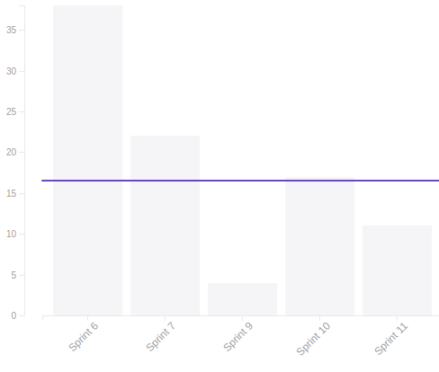
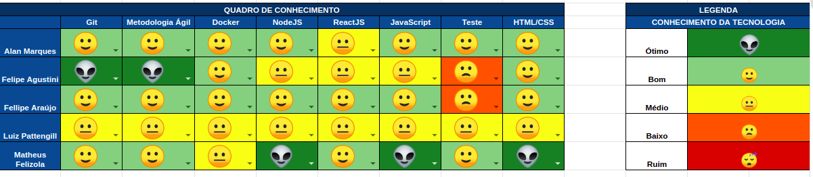

## 1. Sprint 11

**Data de início:** 29 de outubro.

**Data de término:** 05 de novembro.

### Reunião
#### Data da reunião: 04/11

|Nome|Presente|
|----|----|
|Byron Kamal|:heavy_check_mark:|
|João Victor|
<strong>JUSTIFICADO</strong>
|
|Matheus Felizola|:heavy_check_mark:|
|Igor Veludo|:heavy_check_mark:|
|Alan Marques|:heavy_check_mark:|
|Fellipe Araújo|:heavy_check_mark:|
|Felipe Agustini|:heavy_check_mark:|
|Luiz Pettengill|
<strong>JUSTIFICADO</strong>
|

## Review
### Histórias entregues:
- [Editar Perfil](https://github.com/fga-eps-mds/2019.2-Gymnasteg-Wiki/issues/47))
- [Criar Tela de Ranking](https://github.com/fga-eps-mds/2019.2-Gymnasteg-Wiki/issues/45)

### Histórias não entregues:
- [Votação Back-End](https://github.com/fga-eps-mds/2019.2-Gymnasteg-Wiki/issues/53)

### Total de pontos planejados:
- 24 prontos.

### Total de pontos entregues:
- 11 pontos.

### Retrospectiva:
- Pontos positivos: Empenho da equipe e comunicação.
- Pontos negativos: Dívida técnica, gestão do tempo.
- Pontos a melhorar: Pareamento.

### Burndown:

### Velocity:

### Quadro de Conhecimento:

### Métricas:
#### FrontEnd
|Métrica|Resultado|Aceitável?|
|----|----|----|
|MAINTAINABILITY|C|:x:|
|BUILD|PASSING|:heavy_check_mark:|
|TESTS COVERAGE|12,63%|:x:|

#### BackEnd
|Métrica|Resultado|Aceitável?|
|----|----|----|
|MAINTAINABILITY|C|:x:|
|BUILD|PASSING|:heavy_check_mark:|
|TESTS COVERAGE|83,18%|:x:|

### Análise do Scrum Master:
Essa sprint ficou marcada pela desistência de um dos membros de MDS. A equipe de EPS tentou de todas as formas a reintegração desse membro ao projeto, mas o mesmo nem respondia as mensagens. Com isso, EPS precisou reestruturar a equipe para que o projeto não atrase tanto para entrega final do produto.
