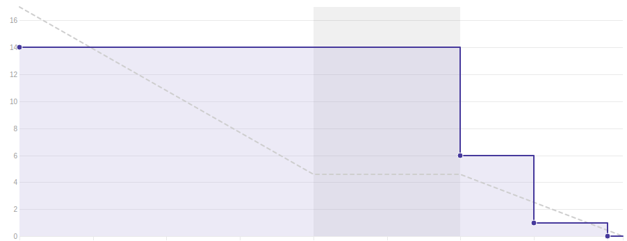
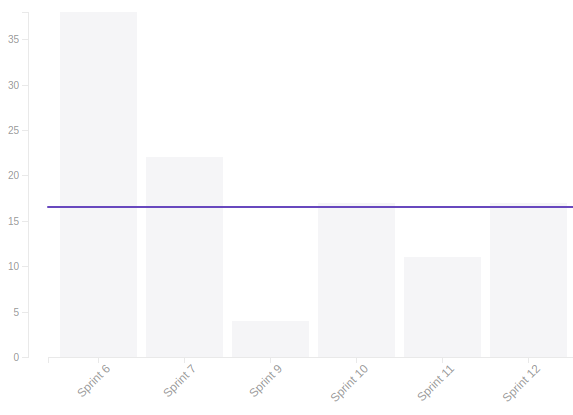
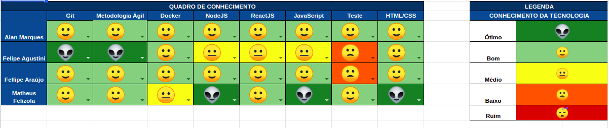

## 1. Sprint 12

**Data de início:** 05 de outubro.

**Data de término:** 12 de novembro.

### Reunião
#### Data da reunião: 11/11

|Nome|Presente|
|----|----|
|Byron Kamal|:heavy_check_mark:|
|João Victor|
<strong>JUSTIFICADO</strong>
|
|Matheus Felizola|:heavy_check_mark:|
|Igor Veludo|:heavy_check_mark:|
|Alan Marques|:heavy_check_mark:|
|Fellipe Araújo|:heavy_check_mark:|
|Felipe Agustini|:heavy_check_mark:|

## Review
### Histórias entregues:
- [Configurar Ambiente de Produção](https://github.com/fga-eps-mds/2019.2-Gymnasteg-Wiki/issues/84)
- [Criar Documento de Modelagem de Requisitos](https://github.com/fga-eps-mds/2019.2-Gymnasteg-Wiki/issues/62)
- [Refatoração de Código](https://github.com/fga-eps-mds/2019.2-Gymnasteg-Wiki/issues/117)
- [Configurar CodeCov](https://github.com/fga-eps-mds/2019.2-Gymnasteg-Wiki/issues/123)

### Histórias não entregues:
- [Votação Back-End](https://github.com/fga-eps-mds/2019.2-Gymnasteg-Wiki/issues/53)

### Total de pontos planejados:
- 36 prontos.

### Total de pontos entregues:
- 17 pontos.

### Retrospectiva:
- Pontos positivos: Empenho da equipe e comunicação.
- Pontos negativos: Dívida técnica, gestão do tempo.
- Pontos a melhorar: Pareamento.

### Burndown:

### Velocity:

### Quadro de Conhecimento:

### Métricas:
#### FrontEnd
|Métrica|Resultado|Aceitável?|
|----|----|----|
|MAINTAINABILITY|C|:x:|
|BUILD|PASSING|:heavy_check_mark:|
|TESTS COVERAGE|24,84%|:x:|

#### BackEnd
|Métrica|Resultado|Aceitável?|
|----|----|----|
|MAINTAINABILITY|C|:x:|
|BUILD|PASSING|:heavy_check_mark:|
|TESTS COVERAGE|74,17,18%|:x:|

### Análise do Scrum Master:
Essa sprint ficou marcada pela urgência de aumentar a cobertura de testes. A equipe de MDS encontrou muita dificuldade, mas aos poucos foram conseguindo entender e aumentar a cobertura de testes. Essa sprint ficou marcada com a saída da matéria de mais um membro de MDS. A cobertura de testes diminuiu devido ao PR de novas funcionalidades que não foram testadas.
