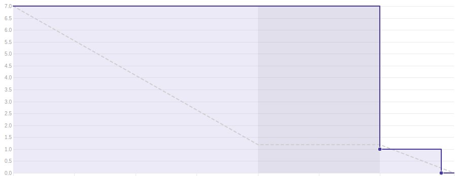
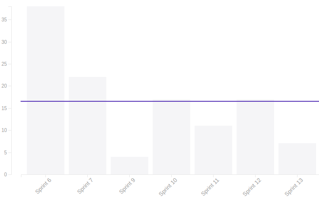
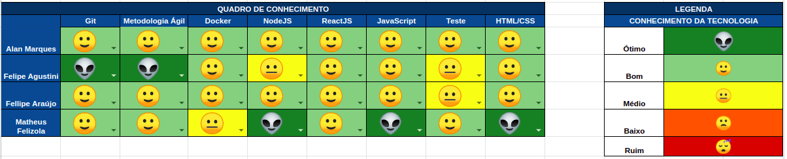

## 1. Sprint 13

**Data de início:** 12 de outubro.

**Data de término:** 19 de novembro.

### Reunião
#### Data da reunião: 18/11

|Nome|Presente|
|----|----|
|Byron Kamal|:heavy_check_mark:|
|João Victor|
<strong>JUSTIFICADO</strong>
|
|Matheus Felizola|:heavy_check_mark:|
|Igor Veludo|:heavy_check_mark:|
|Alan Marques|:heavy_check_mark:|
|Fellipe Araújo|:heavy_check_mark:|
|Felipe Agustini|:heavy_check_mark:|

## Review
### Histórias entregues:
- [Clicar nos Cards da Dashboard e Direcionar para a Retrospectiva Modalidade](https://github.com/fga-eps-mds/2019.2-Gymnasteg-Wiki/issues/125)
- [Excluir Banca](https://github.com/fga-eps-mds/2019.2-Gymnasteg-Wiki/issues/126)
- [Excluir Atleta e Árbitro](https://github.com/fga-eps-mds/2019.2-Gymnasteg-Wiki/issues/128)
- [Associar Coordenador à Banca](https://github.com/fga-eps-mds/2019.2-Gymnasteg-Wiki/issues/127)

### Histórias não entregues:
- [Votação Back-End](https://github.com/fga-eps-mds/2019.2-Gymnasteg-Wiki/issues/53)
- [Votação Front-End](https://github.com/fga-eps-mds/2019.2-Gymnasteg-Wiki/issues/52)

### Total de pontos planejados:
- 33 prontos.

### Total de pontos entregues:
- 7 pontos.

### Retrospectiva:
- Pontos positivos: Empenho da equipe e comunicação.
- Pontos negativos: Dívida técnica, gestão do tempo.
- Pontos a melhorar: Pareamento.

### Burndown:

### Velocity:

### Quadro de Conhecimento:

### Métricas:
#### FrontEnd
|Métrica|Resultado|Aceitável?|
|----|----|----|
|MAINTAINABILITY|C|:x:|
|BUILD|PASSING|:heavy_check_mark:|
|TESTS COVERAGE|49,26%|:x:|

#### BackEnd
|Métrica|Resultado|Aceitável?|
|----|----|----|
|MAINTAINABILITY|C|:x:|
|BUILD|PASSING|:heavy_check_mark:|
|TESTS COVERAGE|74,18%|:x:|

### Análise do Scrum Master:
A equipe está com dificuldade na parte de testes. A US de votação, como é o coração do sistema, entrou em divida técnica mais uma vez. Votação está sendo feita sem testes, e quando gerar o PR, a cobertura de teste irá cair muito.
