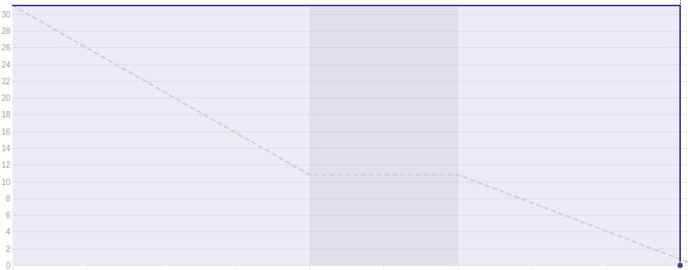
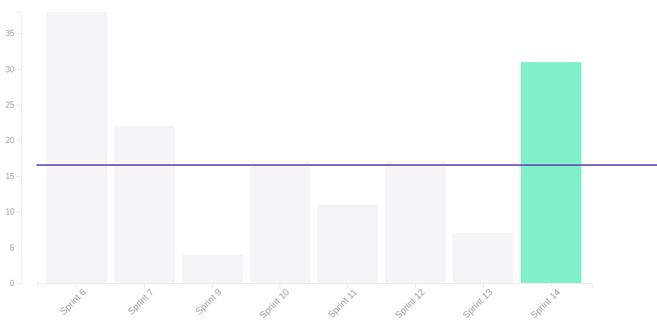
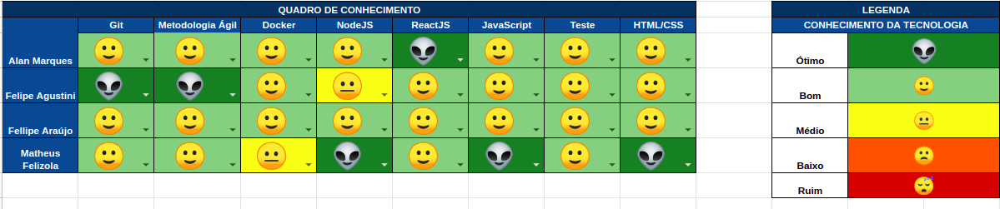

## 1. Sprint 14

**Data de início:** 19 de outubro.

**Data de término:** 26 de novembro.

### Reunião
#### Data da reunião: 25/11

|Nome|Presente|
|----|----|
|Byron Kamal|:heavy_check_mark:|
|João Victor|:heavy_check_mark:|
|Matheus Felizola|:heavy_check_mark:|
|Igor Veludo|:heavy_check_mark:|
|Alan Marques|:heavy_check_mark:|
|Fellipe Araújo|:heavy_check_mark:|
|Felipe Agustini|:heavy_check_mark:|

## Review
### Histórias entregues:
- [Votação Back-End](https://github.com/fga-eps-mds/2019.2-Gymnasteg-Wiki/issues/53)
- [Votação Front-End](https://github.com/fga-eps-mds/2019.2-Gymnasteg-Wiki/issues/52)
- [Criação da Especificação de Caso de Uso](https://github.com/fga-eps-mds/2019.2-Gymnasteg-Wiki/issues/143)
- [Atualizar Documentos de Pipeline de DevOps](https://github.com/fga-eps-mds/2019.2-Gymnasteg-Wiki/issues/124)
- [Documento de Postmortem](https://github.com/fga-eps-mds/2019.2-Gymnasteg-Wiki/issues/131)
- [Criar Documento EVM](https://github.com/fga-eps-mds/2019.2-Gymnasteg-Wiki/issues/142)
- [Aumentar Cobertura de Testes](https://github.com/fga-eps-mds/2019.2-Gymnasteg-Wiki/issues/100)
- [Refatoração de Documentos](https://github.com/fga-eps-mds/2019.2-Gymnasteg-Wiki/issues/113)

### Histórias não entregues:
Não se aplica.

### Total de pontos planejados:
- 31 prontos.

### Total de pontos entregues:
- 31 pontos.

### Retrospectiva:
- Pontos positivos: Empenho da equipe e comunicação.
- Pontos negativos: Gestão do tempo.
- Pontos a melhorar: Pareamento, cobertura de testes.

### Burndown:

### Velocity:

### Quadro de Conhecimento:

### Métricas:
#### FrontEnd
|Métrica|Resultado|Aceitável?|
|----|----|----|
|MAINTAINABILITY|C|:x:|
|BUILD|PASSING|:heavy_check_mark:|
|TESTS COVERAGE|55,19%|:x:|

#### BackEnd
|Métrica|Resultado|Aceitável?|
|----|----|----|
|MAINTAINABILITY|C|:x:|
|BUILD|PASSING|:heavy_check_mark:|
|TESTS COVERAGE|99,36%|:heavy_check_mark:|

### Análise do Scrum Master:
A equipe ainda está com dificuldade na parte de teste de FrontEnd. Os testes de back estão em mais de 99%.
