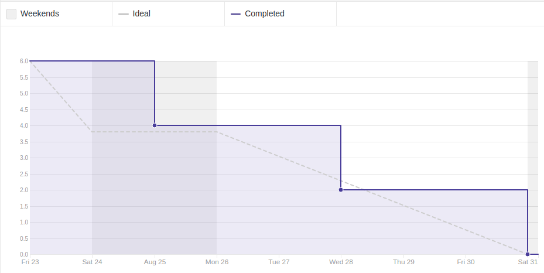
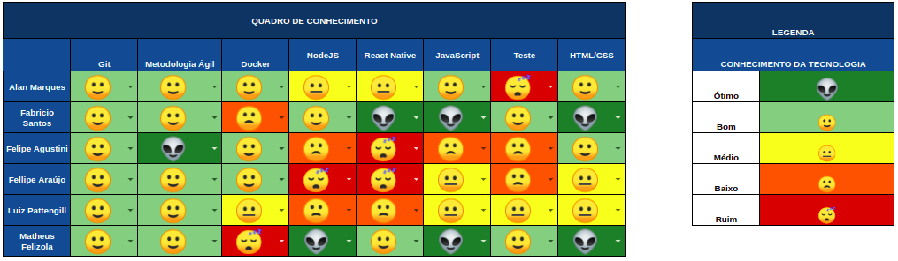

## 1. Sprint 2

**Data de início:** 24 de agosto.

**Data de término:** 31 de agosto.

### Reunião

#### Data da reunião: 31/08

| Nome             | Presente                            |
| ---------------- | ----------------------------------- |
| Byron Kamal      | :heavy_check_mark:                  |
| João Victor      | 
<strong>JUSTIFICADO</strong>
 |
| Matheus Felizola | :heavy_check_mark:                  |
| Igor Veludo      | :heavy_check_mark:                  |
| Alan Marques     | :heavy_check_mark:                  |
| Fellipe Araújo   | :heavy_check_mark:                  |
| Felipe Agustini  | :heavy_check_mark:                  |
| Luiz Pettengill  | :heavy_check_mark:                  |
| Fabrício Santos  | :heavy_check_mark:                  |

## Review

### Histórias entregues:

- [Template de pull request](https://github.com/fga-eps-mds/2019.2-Grupo8/issues/10)
- [Política de repositório](https://github.com/fga-eps-mds/2019.2-Grupo8/issues/11)
- [Estudo sobre docker](https://github.com/fga-eps-mds/2019.2-Grupo8/issues/8)
- [Treinamento de metodologia ágil](https://github.com/fga-eps-mds/2019.2-Grupo8/issues/7)
- [Template de issue](https://github.com/fga-eps-mds/2019.2-Grupo8/issues/9)
- [Github pages](https://github.com/fga-eps-mds/2019.2-Grupo8/issues/5)

### Histórias não entregues:

Não de aplica

### Total de pontos planejados:

Não se aplica.

### Total de pontos entregues:

Não se aplica.

### Retrospectiva:

Não se aplica.

### Burndown:

### Velocity:
Não se aplica.

### Quadro de Conhecimento:

### Análise do Scrum Master:

Alguns membros possuem conhecimento sobre as tecnologias que serão utilizadas. Foi definido pareamento para a próxima sprint para o nivelamento do time de desenvolvimento.

