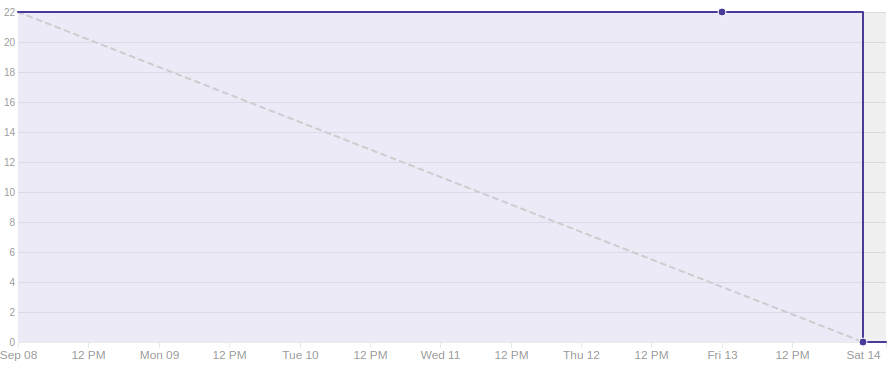
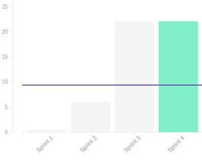
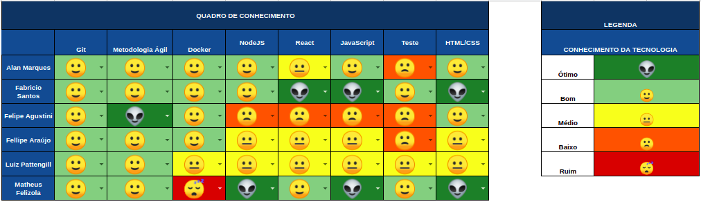

## 1. Sprint 4

**Data de início:** 8 de setembro.

**Data de término:**  14 de setembro.

### Reunião
#### Data da reunião: 07/09

|Nome|Presente|
|----|----|
|Byron Kamal|:heavy_check_mark: |
|João Victor|:heavy_check_mark:|
|Matheus Felizola|:heavy_check_mark:|
|Igor Veludo|:heavy_check_mark:|
|Alan Marques|:heavy_check_mark:|
|Fellipe Araújo|:heavy_check_mark:|
|Felipe Agustini|:heavy_check_mark:|
|Luiz Pettengill|:heavy_check_mark:|
|Fabrício Santos|:heavy_check_mark:|

## Review
### Histórias entregues:
- [Reunião com o cliente](https://github.com/fga-eps-mds/2019.2-Gymnasteg-Wiki/issues/19)
- [Estrutura analítica do projeto (EAP)](https://github.com/fga-eps-mds/2019.2-Gymnasteg-Wiki/issues/21)
- [Plano de comunicação](https://github.com/fga-eps-mds/2019.2-Gymnasteg-Wiki/issues/12)
- [Documento de visão](https://github.com/fga-eps-mds/2019.2-Gymnasteg-Wiki/issues/18)
- [Github pages](https://github.com/fga-eps-mds/2019.2-Grupo8/issues/5)
- [Criação da logo do projeto](https://github.com/fga-eps-mds/2019.2-Gymnasteg-Wiki/pull/26)
- [Reunião de alinhamento de projeto](https://github.com/fga-eps-mds/2019.2-Gymnasteg-Wiki/issues/25)
- [Aprender tecnologias](https://github.com/fga-eps-mds/2019.2-Gymnasteg-Wiki/issues/14)

### Histórias não entregues:
- [Criar plano de gerenciamento de custos](https://github.com/fga-eps-mds/2019.2-Gymnasteg-Wiki/issues/38)
### Total de pontos planejados:
- 23 pontos.

### Total de pontos entregues:
- 22 pontos.

### Retrospectiva:
- Pontos positivos: Resposta rápida aos erros de ferramentas. Alinhamento da equipe com o projeto.
- Pontos negativos: Dívida técnica de um dos documentos.
- Pontos a melhorar: Nivelar conhecimentos das tecnologias entre os membros de MDS. Melhora nos pareamentos.

### Burndown:

### Velocity:

### Quadro de Conhecimento:

### Análise do Scrum Master:

Devido a viagem de um dos membros de desenvolvimento, um dos pareamentos ficou prejudicado. Devido a isso o grupo de gerenciamento decidiu fazer um pareamento de 3 pessoas, afim de contornar o problema. Devido ao tempo, estão ocorrendo problemas nos paremanetos que estao sendo resolvido
  
