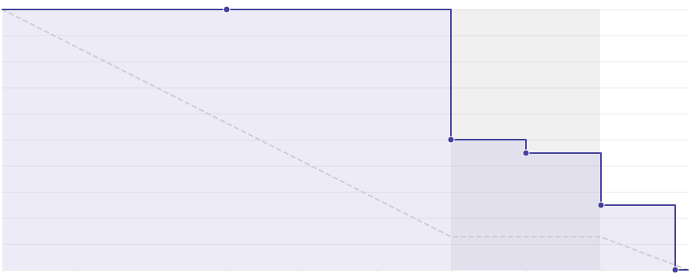
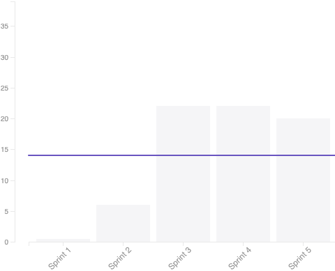

## 1. Sprint 5

**Data de início:** 15 de setembro.

**Data de término:**  21 de setembro.

### Reunião
#### Data da reunião: 07/09

|Nome|Presente|
|----|----|
|Byron Kamal|:heavy_check_mark: |
|João Victor|:heavy_check_mark:|
|Matheus Felizola|:heavy_check_mark:|
|Igor Veludo|:heavy_check_mark:|
|Alan Marques|:heavy_check_mark:|
|Fellipe Araújo|:heavy_check_mark:|
|Felipe Agustini|
<strong>JUSTIFICADO</strong>
|
|Luiz Pettengill|:heavy_check_mark:|
|Fabrício Santos|:heavy_check_mark:|

## Review
### Histórias entregues:
- [Criar plano de gerenciamento de custos](https://github.com/fga-eps-mds/2019.2-Gymnasteg-Wiki/issues/38)
- [Subir template de PR para os repositórios do fron-end e back-end](https://github.com/fga-eps-mds/2019.2-Gymnasteg-Wiki/issues/63)
- [US02#CadastroDaBanca(api)](https://github.com/fga-eps-mds/2019.2-Gymnasteg-Wiki/issues/49)
- [Criar roadmap do projeto](https://github.com/fga-eps-mds/2019.2-Gymnasteg-Wiki/issues/57)
- [Criar read-me do projeto](https://github.com/fga-eps-mds/2019.2-Gymnasteg-Wiki/issues/58)
- [US01#Login - Unir o frontend com o backend](https://github.com/fga-eps-mds/2019.2-Gymnasteg-Wiki/issues/65)
- [Atualizar layout da tela de Login](https://github.com/fga-eps-mds/2019.2-Gymnasteg-Wiki/issues/64)

### Histórias não entregues:
- [Configurar ferramenta de CI](https://github.com/fga-eps-mds/2019.2-Gymnasteg-Wiki/issues/59)
### Total de pontos planejados:
- 25 pontos.

### Total de pontos entregues:
- 20 pontos.

### Retrospectiva:
- Pontos positivos: Resposta rápida aos erros de ferramentas. Alinhamento da equipe com o projeto.
- Pontos negativos: Falta de comunicação.
- Pontos a melhorar: Comunicação, alinhamento da equipe e divida técnica das issues.

### Burndown:

### Velocity:

### Métricas:
#### FrontEnd
|Métrica|Resultado|Aceitável?|
|----|----|----|
|MAINTAINABILITY|C|:x:|
|BUILD|PASSING|:heavy_check_mark:|
|TESTS COVERAGE|32,5%|:x:|

#### BackEnd
|Métrica|Resultado|Aceitável?|
|----|----|----|
|MAINTAINABILITY|C|:x:|
|BUILD|PASSING|:heavy_check_mark:|
|TESTS COVERAGE|?|:x:|

### Quadro de Conhecimento:

### Análise do Scrum Master:

Os grupos de pareamento tem gerado resultados positivos. Porém, alguns dos membros de desenvolvimento estão ficando para trás em relação ao desenvolvimento do grupo no geral. Equipe de EPS tem trabalhando soluções para que esses problemas possam ser contornados o mais rápido possível, para que a equipe de MDS tenha um desenvolvimento equilibrado.
  
