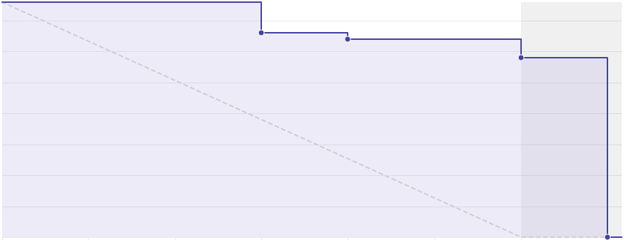
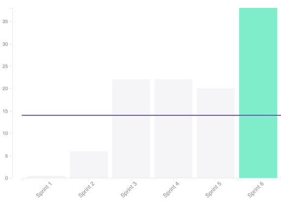
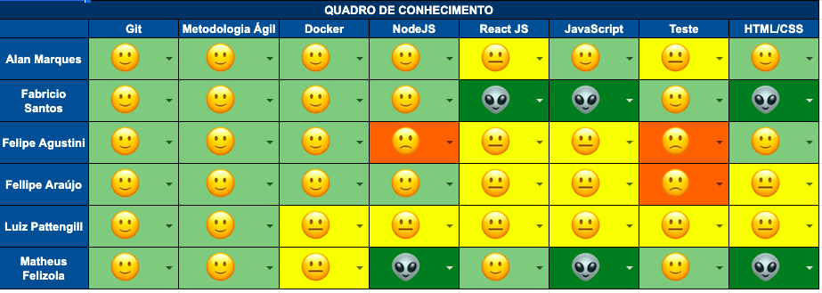

## 1. Sprint 6

**Data de início:** 22 de setembro.

**Data de término:** 29 de setembro.

### Reunião
#### Data da reunião: 28/09

|Nome|Presente|
|----|----|
|Byron Kamal|:heavy_check_mark: |
|João Victor|:heavy_check_mark:|
|Matheus Felizola|:heavy_check_mark:|
|Igor Veludo|:heavy_check_mark:|
|Alan Marques|:heavy_check_mark:|
|Fellipe Araújo|:heavy_check_mark:|
|Felipe Agustini|
<strong>JUSTIFICADO</strong>
|
|Luiz Pettengill|
<strong>JUSTIFICADO</strong>
|
|Fabrício Santos|:heavy_check_mark:|

## Review
### Histórias entregues:
- [Adicionar campo de tipo de árbitro](https://github.com/fga-eps-mds/2019.2-Gymnasteg-Wiki/issues/85)
- [Criar documento de priorização de requisitos](https://github.com/fga-eps-mds/2019.2-Gymnasteg-Wiki/issues/61)
- [Criar documento de elicitação requisitos](https://github.com/fga-eps-mds/2019.2-Gymnasteg-Wiki/issues/60)
- [Criar documento de priorização de requisitos](ttps://github.com/fga-eps-mds/2019.2-Gymnasteg-Wiki/issues/61)
- [Criar metodologia](https://github.com/fga-eps-mds/2019.2-Gymnasteg-Wiki/issues/79)
- [US01#Login - Unir o frontend com o backend](https://github.com/fga-eps-mds/2019.2-Gymnasteg-Wiki/issues/65)
- [Criar backlog do produto](https://github.com/fga-eps-mds/2019.2-Gymnasteg-Wiki/issues/78)
- [US01#CadastroDaBanca - Unir o frontend com o backend](https://github.com/fga-eps-mds/2019.2-Gymnasteg-Wiki/issues/66)
- [Criar protótipo de alta fidelidade](https://github.com/fga-eps-mds/2019.2-Gymnasteg-Wiki/issues/55)
- [Configurar Code Climate](https://github.com/fga-eps-mds/2019.2-Gymnasteg-Wiki/issues/80)
- [US03#Dashboard](https://github.com/fga-eps-mds/2019.2-Gymnasteg-Wiki/issues/74)
- [US04#CadastroDeAtleta(forms)](https://github.com/fga-eps-mds/2019.2-Gymnasteg-Wiki/issues/73)
- [US06#Cadastro de árbitro (forms)](https://github.com/fga-eps-mds/2019.2-Gymnasteg-Wiki/issues/69)
- [Configurar ferramenta de CI](https://github.com/fga-eps-mds/2019.2-Gymnasteg-Wiki/issues/59)

### Histórias não entregues:
Não se aplica.
### Total de pontos planejados:
- 38 pontos.

### Total de pontos entregues:
- 38 pontos.

### Retrospectiva:
- Pontos positivos: Resposta rápida aos erros de ferramentas. Alinhamento da equipe com o projeto.
- Pontos negativos: Falta de comunicação.
- Pontos a melhorar: Comunicação, alinhamento da equipe.

### Burndown:

### Velocity:

### Métricas:
Não se aplica.

### Quadro de Conhecimento:

### Análise do Scrum Master:

Um dos membros de desenvolvimento está com problemas pessoais e isso está afetando o seu rendimento. O grupo está ciente e a equipe de EPS está fazendo tudo para mante-lo por dentro do projeto.
  
