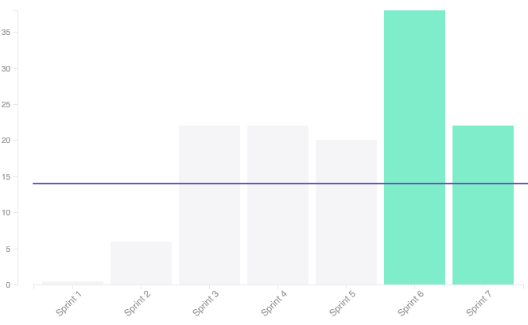
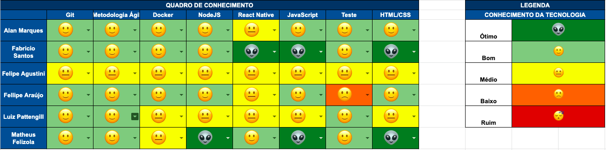

## 1. Sprint 7

**Data de início:** 30 de setembro.

**Data de término:** 07 de outubro.

### Reunião
#### Data da reunião: 28/09

|Nome|Presente|
|----|----|
|Byron Kamal|:heavy_check_mark:|
|João Victor|
<strong>JUSTIFICADO</strong>
|
|Matheus Felizola|:heavy_check_mark:|
|Igor Veludo|:heavy_check_mark:|
|Alan Marques|:heavy_check_mark:|
|Fellipe Araújo|:heavy_check_mark:|
|Felipe Agustini|
<strong>JUSTIFICADO</strong>
|
|Luiz Pettengill|
<strong>JUSTIFICADO</strong>
|
|Fabrício Santos|:heavy_check_mark:|

## Review
### Histórias entregues:
- [Criar canvas](https://github.com/fga-eps-mds/2019.2-Gymnasteg-Wiki/issues/77)
- [Configurar Ambiente de Homologação](https://github.com/fga-eps-mds/2019.2-Gymnasteg-Wiki/issues/82)
- [US12#VisualizarDadosCadastrados](https://github.com/fga-eps-mds/2019.2-Gymnasteg-Wiki/issues/89)
- [Atualizar o protótipo](https://github.com/fga-eps-mds/2019.2-Gymnasteg-Wiki/issues/87)
- [Criar metodologia](https://github.com/fga-eps-mds/2019.2-Gymnasteg-Wiki/issues/79)
- [Configurar Codecov](https://github.com/fga-eps-mds/2019.2-Gymnasteg-Wiki/issues/65)
- [Criar perfil de comunidade Open Source](https://github.com/fga-eps-mds/2019.2-Gymnasteg-Wiki/issues/101)
- [US01#CadastroDaBanca - Unir o frontend com o backend](https://github.com/fga-eps-mds/2019.2-Gymnasteg-Wiki/issues/66)
- [Atualizar Login](https://github.com/fga-eps-mds/2019.2-Gymnasteg-Wiki/issues/88)

### Histórias não entregues:
Não se aplica.
### Total de pontos planejados:
- 22 pontos.

### Total de pontos entregues:
- 22 pontos.

### Retrospectiva:
- Pontos positivos: Resposta rápida do time de desenvolvimento.
- Pontos negativos: Falta de comunicação.
- Pontos a melhorar: Comunicação, alinhamento da equipe.

### Burndown:

### Velocity:

### Métricas:
#### FrontEnd
|Métrica|Resultado|Aceitável?|
|----|----|----|
|MAINTAINABILITY|C|:x:|
|BUILD|PASSING|:heavy_check_mark:|
|TESTS COVERAGE|32,5%|:x:|

#### BackEnd
|Métrica|Resultado|Aceitável?|
|----|----|----|
|MAINTAINABILITY|C|:x:|
|BUILD|PASSING|:heavy_check_mark:|
|TESTS COVERAGE|?|:x:|

### Quadro de Conhecimento:

### Análise do Scrum Master:

Um dos membros está em estado crítico. Acontecimentos pessoais estão tirando o foco desse membro ao projeto. Equipe de EPS ja está ciente e fazendo o possível para que ele possa voltar ao projeto assim que os problemas pessoais forem resolvidos.
  
