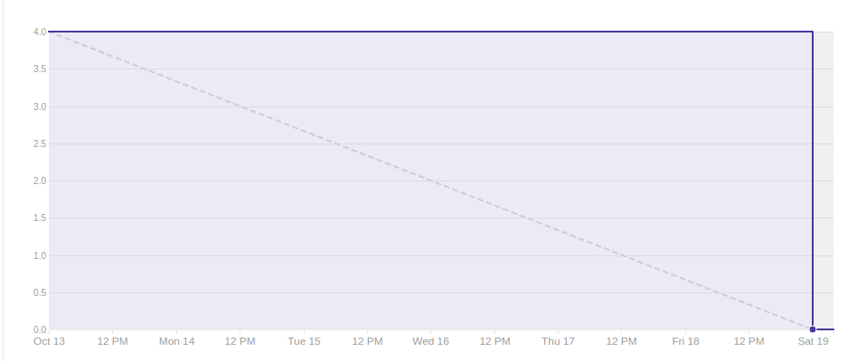
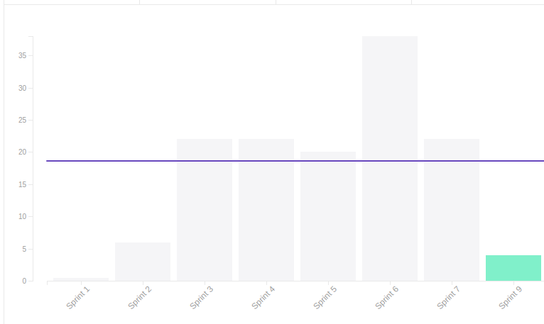

## 1. Sprint 9

**Data de início:** 14 de outubro.

**Data de término:** 20 de outubro.

### Reunião
#### Data da reunião: 19/10

|Nome|Presente|
|----|----|
|Byron Kamal|:heavy_check_mark:|
|João Victor|
<strong>JUSTIFICADO</strong>
|
|Matheus Felizola|:heavy_check_mark:|
|Igor Veludo|
<strong>JUSTIFICADO</strong>
|
|Alan Marques|:heavy_check_mark:|
|Fellipe Araújo|:heavy_check_mark:|
|Felipe Agustini|
<strong>JUSTIFICADO</strong>
|
|Luiz Pettengill|
<strong>JUSTIFICADO</strong>
|
|Fabrício Santos|:heavy_check_mark:|

## Review
### Histórias entregues:
- [Editar Banca](https://github.com/fga-eps-mds/2019.2-Gymnasteg-Wiki/issues/44)
- [Autenticação de Requisição](https://github.com/fga-eps-mds/2019.2-Gymnasteg-Wiki/issues/116)

### Histórias não entregues:
- [Editar perfil](https://github.com/fga-eps-mds/2019.2-Gymnasteg-Wiki/issues/47)
- [Dashboard do Árbitro](https://github.com/fga-eps-mds/2019.2-Gymnasteg-Wiki/issues/114)
- [Dashboard do Árbitro](https://github.com/fga-eps-mds/2019.2-Gymnasteg-Wiki/issues/115)

### Total de pontos planejados:
- 19 prontos.

### Total de pontos entregues:
- 4 pontos.

### Retrospectiva:
- Pontos positivos: Não se aplica.
- Pontos negativos: Dívida técnica, e comunicação.
- Pontos a melhorar: Comunicação, pareamento.

### Burndown:

### Velocity:

### Métricas:
#### FrontEnd
|Métrica|Resultado|Aceitável?|
|----|----|----|
|MAINTAINABILITY|C|:x:|
|BUILD|PASSING|:heavy_check_mark:|
|TESTS COVERAGE|32,5%|:x:|

#### BackEnd
|Métrica|Resultado|Aceitável?|
|----|----|----|
|MAINTAINABILITY|C|:x:|
|BUILD|PASSING|:heavy_check_mark:|
|TESTS COVERAGE|75,37%|:x:|

### Análise do Scrum Master:
Essa sprint houve a pior produção da equipe no projeto. Os membros de EPS estão fazendo o possível para que tudo volte ao normal nas próximas sprints. Alguns membros não estão produzindo, e cabe a EPS buscar a solução para as próximas sprints.
