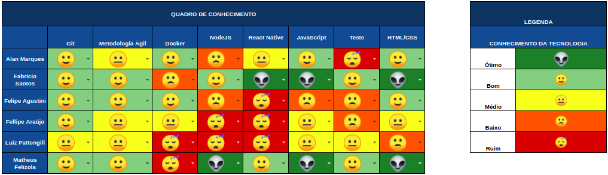

## 1. Sprint 1

**Data de início:** 18 de agosto.

**Data de término:**  24 de agosto.

### Reunião
Não se aplica.

### Review
Não se aplica.

### Histórias entregues:
Não se aplica.

### Histórias não entregues:
Não se aplica.

### Total de pontos planejados:
Não se aplica.

### Total de pontos entregues:
Não se aplica.

### Retrospectiva:
Não se aplica.

### Burndown:
Não se aplica.

### Velocity:
Não se aplica.

### Métricas:
Não se aplica.

### Quadro de Conhecimento:

### Análise do Scrum Master:

A equipe mostrou-se bastante madura em relação ao git. Tema não decidido. 
  
