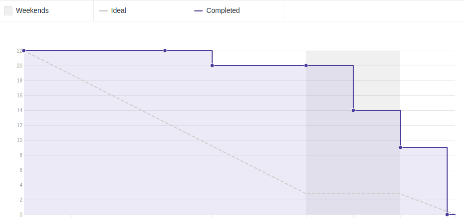
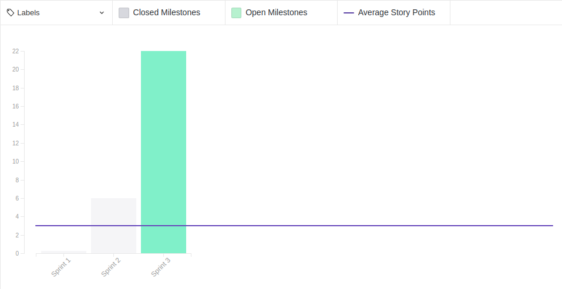

## 1. Sprint 3

**Data de início:** 1 de setembro.

**Data de término:**  8 de setembro.

### Reunião
#### Data da reunião: 07/09

|Nome|Presente|
|----|----|
|Byron Kamal|:heavy_check_mark: |
|João Victor|:heavy_check_mark:|
|Matheus Felizola|:heavy_check_mark:|
|Igor Veludo|:heavy_check_mark:|
|Alan Marques|
<strong>JUSTIFICADO</strong>
|
|Fellipe Araújo|:heavy_check_mark:|
|Felipe Agustini|
<strong>JUSTIFICADO</strong>
|
|Luiz Pettengill|:heavy_check_mark:|
|Fabrício Santos|:heavy_check_mark:|

## Review
### Histórias entregues:
- [Reunião com o cliente](https://github.com/fga-eps-mds/2019.2-Gymnasteg-Wiki/issues/19)
- [Estrutura analítica do projeto (EAP)](https://github.com/fga-eps-mds/2019.2-Gymnasteg-Wiki/issues/21)
- [Plano de comunicação](https://github.com/fga-eps-mds/2019.2-Gymnasteg-Wiki/issues/12)
- [Documento de visão](https://github.com/fga-eps-mds/2019.2-Gymnasteg-Wiki/issues/18)
- [Github pages](https://github.com/fga-eps-mds/2019.2-Grupo8/issues/5)
- [Criação da logo do projeto](https://github.com/fga-eps-mds/2019.2-Gymnasteg-Wiki/pull/26)
- [Reunião de alinhamento de projeto](https://github.com/fga-eps-mds/2019.2-Gymnasteg-Wiki/issues/25)
- [Aprender tecnologias](https://github.com/fga-eps-mds/2019.2-Gymnasteg-Wiki/issues/14)

### Histórias não entregues:
Não de aplica
### Total de pontos planejados:
- 22 pontos.

### Total de pontos entregues:
- 22 pontos.

### Retrospectiva:
- Pontos positivos: A equipe se mostrou bem participativa com relação ao projeto. A comunicação fluiu muito bem.
- Pontos negativos: Viagem de um membro da equipe de MDS, o que ocasionou um problema em um dos pareamentos.
- Pontos a melhorar: Nivelar conhecimentos das tecnologias entre os membros de MDS.

### Burndown:

### Velocity:

### Métricas:
Não se aplica.

### Quadro de Conhecimento:

### Análise do Scrum Master:

Grupo mostrou-se bem comprometido com os pareamentos. Único problema que tivemos foi a viagem de um dos membros, que comprometeu um dos pareamentos. Com base nisso, o pareamento da sprint4 será de dois grupos de três membros, para que o grupo consiga alinhas os conhecimentos. 
  
